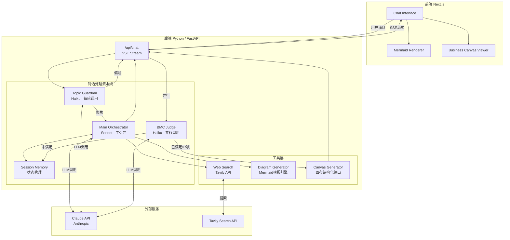
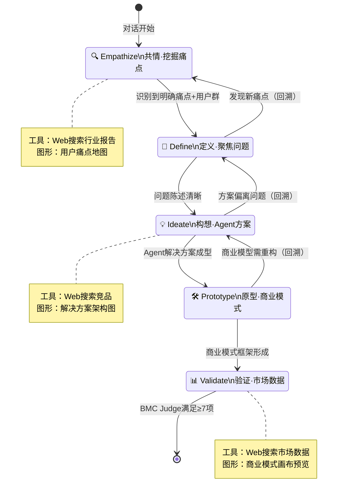
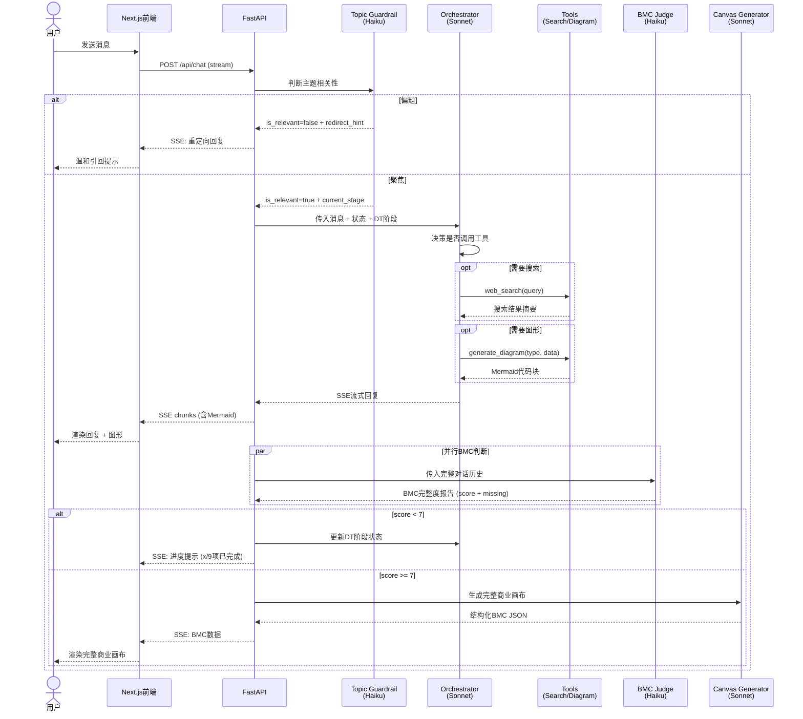
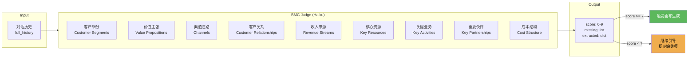

# TokenFounder 系统架构设计

## 1. 整体架构概览



---

## 2. 对话状态机（DT五阶段）



---

## 3. 单轮对话处理时序



---

## 4. 商业完整度判断逻辑



---

## 5. 项目目录结构

```
TokenFounder/
├── docs/
│   ├── architecture.md          # 本文件：系统架构
│   └── prompts.md               # 所有Agent提示词
│
├── backend/
│   ├── pyproject.toml           # 依赖管理 (uv)
│   ├── main.py                  # FastAPI入口
│   ├── agents/
│   │   ├── __init__.py
│   │   ├── orchestrator.py      # 主编排Agent (Sonnet)
│   │   ├── guardrail.py         # 主题守护 (Haiku)
│   │   ├── bmc_judge.py         # 商业完整度判断 (Haiku)
│   │   └── canvas_generator.py  # 商业画布生成 (Sonnet)
│   ├── tools/
│   │   ├── __init__.py
│   │   ├── web_search.py        # Tavily搜索工具
│   │   └── diagram.py           # Mermaid模板生成
│   ├── models/
│   │   ├── __init__.py
│   │   ├── session.py           # 会话状态 (DT阶段 + BMC积累)
│   │   └── bmc.py               # 商业画布数据模型
│   └── config.py                # 环境变量 & 常量
│
├── frontend/
│   ├── package.json
│   ├── app/
│   │   ├── layout.tsx
│   │   └── page.tsx             # 主聊天页面
│   └── components/
│       ├── ChatWindow.tsx       # 对话窗口
│       ├── MessageBubble.tsx    # 消息气泡(支持Mermaid)
│       ├── ProgressBar.tsx      # BMC完整度进度条
│       └── BusinessCanvas.tsx   # 商业画布展示组件
│
└── README.md
```

---

## 6. 技术选型说明

| 层级 | 技术 | 选择理由 |
|------|------|---------|
| 主引导LLM | claude-sonnet-4-6 | 高质量对话推理，工具调用能力强 |
| 守护/判断LLM | claude-haiku-4-5 | 低延迟低成本，每轮并行调用 |
| 后端框架 | FastAPI + SSE | 原生支持流式输出，Python生态丰富 |
| 前端框架 | Next.js 14 (App Router) | React生态，易集成Mermaid.js |
| 搜索工具 | Tavily API | 专为LLM设计，返回结构化摘要 |
| 图形渲染 | Mermaid.js | 纯文本描述图形，LLM天然友好 |
| 状态存储 | 内存 (dict) → Redis | MVP阶段内存，后续扩展Redis |
| 依赖管理 | uv (Python) | 现代Python包管理，速度快 |
